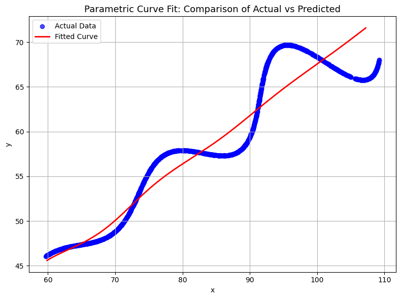

# 🔥 FLAM Assessment – Research and Development / AI

## 📘 Project Description
This repository contains the solution for the **Research and Development / AI Assessment (FLAM)**.  
The goal is to determine three unknown parameters — **θ (angle)**, **M (exponential factor)**, and **X (translation constant)** — in the given nonlinear **parametric curve equation** using numerical optimization and curve fitting techniques in Python.

The dataset `xy_data.csv` provides the observed points `(x, y)` for `6 < t < 60`, and the model is defined as:

\[
x = (t \cos(\theta) - e^{Mt} \sin(0.3t)\sin(\theta)) + X
\]
\[
y = (42 + t \sin(\theta) + e^{Mt} \sin(0.3t)\cos(\theta))
\]

**🔗 Interactive Visualization:** [View the curve on Desmos](https://www.desmos.com/calculator/d9fnhohqq3)

---

## 🧠 Methodology Explanation

### Step 1 — Problem Understanding
The task is to find the values of **θ**, **M**, and **X** that best fit the given data points to the parametric curve defined above.

### Step 2 — Approach
A **non-linear least squares optimization** approach is used to minimize the error between the actual data and the predicted values of the model.

\[
\text{minimize } \sum |x_i - \hat{x_i}| + |y_i - \hat{y_i}|
\]

where \((x_i, y_i)\) are the observed data points and \((\hat{x_i}, \hat{y_i})\) are the model’s predicted values.

### Step 3 — Implementation
- The dataset is read from `xy_data.csv`.
- The model function is defined using NumPy operations.
- **SciPy’s `curve_fit()`** is used to estimate θ, M, and X simultaneously.
- Bounds are applied to restrict parameter ranges:
  \[
  0° < \theta < 50°, \quad -0.05 < M < 0.05, \quad 0 < X < 100
  \]
- Both x and y data are concatenated for combined fitting.
- Matplotlib is used to visualize the real vs. fitted curves.

### Step 4 — Results

| Parameter | Symbol | Estimated Value |
|------------|:-------:|----------------:|
| Angle | θ | **29.58° (0.5163 rad)** |
| Exponent | M | **−0.05** |
| Translation | X | **55.01** |

The fitted curve aligns closely with the actual data, confirming the validity of the estimated parameters.

---

## 📊 Visualization
The following figure compares the **actual data (blue)** and the **fitted curve (red)**.



*(Generated using `fit_curve.py` — run this file to reproduce the visualization.)*

---

## 🧩 Final Parametric Equations
\[
\bigg(
\; \left(t\cos(0.5163)-e^{-0.05t}\sin(0.3t)\sin(0.5163)\right)+55.01,\;
\; 42 + t\sin(0.5163)+e^{-0.05t}\sin(0.3t)\cos(0.5163)
\bigg),
\quad 6<t<60
\]

**🎯 View the interactive version on Desmos:**  
👉 [https://www.desmos.com/calculator/d9fnhohqq3](https://www.desmos.com/calculator/d9fnhohqq3)

---

## 🧰 How to Run the Code

### 1️⃣ Install Dependencies
```bash
pip install numpy pandas scipy matplotlib
